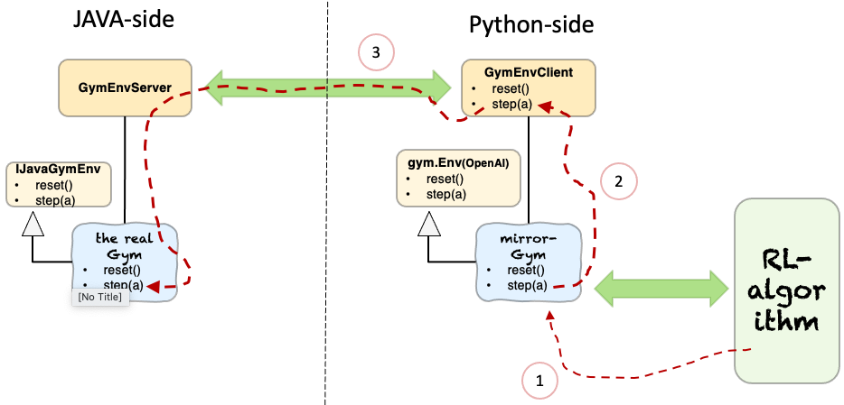

## SquareWorld Example

SquareWorld is a very simple world in Java. It is a 2D NxN grid-world. The grid consists of tiles. There is an imaginary robot dropped in the center of this world. The goal of the robot is to reach the top-right corner of the world (so, location (N-1,N-1)). The robot can be steered by moving it left/right/up/down, to a neighbouring tile. If it moves off the grid, it crashes. The picture below is just for your imagination; we don't actually have a GUI.


This world is implemented in the class [SquareWorld](../src/main/java/eu/iv4xr/japyre/rl/examples/SquareWorld.java). The class offers a method `step(action)` to move the robot, where action is left/right/up/down:

```Java
class SquareWorld{
  int size ;
  Location currentLocation ; // robot location
  public SquareWorld(int size) {
		this.size = size ;
		currentLocation = new Location(size/2,size/2) ;
	}
  public ... step(String action) {
      if (action == LEFT) currentLocation.x -- ;
      ...
      return (... currentLocation ... reward ... )
  }
```


The method `step()` returns an object containing, essentially, the new state of the robot (its new position), and some reward. The reward is +100 if the action brings the robot to the goal-location, -100 if it causes the robot to fall off the grid, and else 0.

**Side-note: 'state' or 'observation'?** Above we say that step() returns an object that includes the robot's current 'state'. In RL we also say 'observation' rather than 'state', to account that an observation, for various reasons, may not reveal all information that is originally in a state. So, conceptually an observation can be more abstract than the state it derives from.
Here we will use the term 'observation' and 'state' interchangeably as from Japyre's perspective the difference is less relevant.

We want now to use some RL-library in Python to train some model with which we can 'drive' the robot in such a way that we get at least some good amount of reward (in our case, getting 'some (positive) reward' implies the robot also reaches its goal!). We are not going to look at which RL algorithm would be the best for our training (it is a simple problem anyway); but we will look instead at how we can connect Java and Python to make it possible to use that Python library.

We will assume that the RL-library can work with targets which are instances of OpenAI `gym.Env` class.
So, to target our SquareWorld ultimately we will have to create a subclass of `gym.Env` that somehow controls the actual SquareWorld. However, since SquareWorld is in Java, we will somehow need to connect the two.

Generally, the architecture of the connection is shown in the picture below:



We extend SquareWorld at the Java-side to implement the same (or at least similar) APIs as wanted by `gym.Env`.
We also construct a mirror-Gym at the Pyton side.
The RL-algorithm on the right only sees the mirror-gym. The algorithm will want to call methods like `reset()` and `step()` from this gym (1 in the picture). The mirror-gym forwards the call to the `GymEnvClient` (2 in the picture), which in turn forwards the call (3 in the picture) to the real Gym in Java via a TCP/IP socket connection.

The `GymEnvClient` and `GymEnvServer` components are provided by Japyre. Your part is to construct the Gym and mirror-Gym.  A link to an example of how to implement this scheme is provided below.

The steps to implement the above scheme are detailed below.

#### 1. Implementing Java-side `gym.Env` APIs

The Java-version of these APIs are as specified by the Interface [`IJavaGymEnv`](../src/main/java/eu/iv4xr/japyre/rl/IJavaGymEnv.java). It contains methods like `reset()` and `step()` that are also present in the original Python's `gym.Env`:

```Java
interface IJavaGymEnv<Observation> {
   public Observation reset() ;
   public void close() ;
   public List<String> actionSpace() ;
   public RLStepData<Observation> step(String action) ;
}

class SquareWorld implements IJavaGymEnv<Location> { ... }
```

It happens that the implementation of `SquareWorld` also implements `IJavaGymEnv`, so it has all those APIs above. You can check its code: [SquareWorld](../src/main/java/eu/iv4xr/japyre/rl/examples/SquareWorld.java).

 #### 2. Implementing Python-side `gym.Env`

`gym.Env` is actually a class. By 'implementing' it we mean to write a subclass of it. Here are the key methods that should be implemented/overriden (see also [SB3 documentation on this](https://stable-baselines3.readthedocs.io/en/master/guide/custom_env.html) ):

```Python
class SqWorldEnv(gym.Env):
    # constructor:
    def __init__(self, arg1, arg2, ...):
        ...
        self.action_space      = ...
        self.observation_space = ...

    def step(self, action):
        ...
        return (observation, reward, done, other-info)  # a tuple
    def reset(self):
        ...
        return observation  
    def close (self): ...
```

These methods should now call the corresponding methods in `SquareWorld`. Since the latter resides in Java, we will use a client-server connection to do this. The Java-side will be the server, and the Python-side the client. So, we need a client. We can deploy one in the constructor of `SqWorldEnv` (Python-side). It looks like this:

```Python
class SqWorldEnv(gym.Env):
    # constructor:
    def __init__(self, worldSize):
        ...
        # create and run a client; this will connect to the Java-side:
        self.javaGym = GymEnvClient("127.0.0.1",9999)
        # from this point on, we can access self.javaGym's methods, e.g.
        # self.javaGym.step()

        # the rest of the constructor:
        ...
```

Notice the constructor above creates an instance of `GymEnvClient` a store a reference to this client in `self.javaGym`. We can now access the client's methods. For example, here is the implementation of the method `step(action)` of the class `SqWorldEnv`:

```Python
class SqWorldEnv(gym.Env):
   ...
   def step(self,action):
          o,rw,done,info = self.javaGym.step(self.javaGym.actionSpace[action])
          return (np.array([o["x"], o["y"]]), rw, done, info)
   ...        
```

Notice that the `step(a)` of `SqWorldEnv` forwards the call to `javaGym` (which is an instance of `GymEnvClient`), which in turn will call the Java-side `step(a)` of the (Java) class `SquareWorld`. The last call went through a socket connection, but this is transparent to you.

You can see the full code of here:

   * class [SqWorldEnv](../python/src/japyre/sqworld_env.py)
   * class [GymEnvClient](../python/src/japyre/gymenv_client.py)

#### 3. Hook an RL algorithm to your Env

As an example let us just use a simple Q-learning algorithm. There is an implementation of this provided in Japyre:

   * class [Qlearning](../python/src/japyre/qlearning.py). This class can target instances of `gym.Env`, so it can target our `SqWorldEnv` as well. The key method is `learn(env,N)` to learn/train a model from an env, and `getRun(env,n)` to generate a run (sequence of actions) from a trained model.

A Q-learning algorithm maintains a so-called qtable, which is a 2D table such that qtable(s,a) gives the value of doing the action a on the state s. The implementation does not literally has a table over the domain of states and actions, but rather it is a table over indices of states and actions. So, it indeed assumes we have finite number of states and actions, and that they can be indexed. For example, the state of our robot in the SquareWorld is represented by its location (x,y). We need to decide how we want to index this.

For an NxN SquareWorld, possible values of x and y range in [0..N-1], but additionally also -1 and N to account for positions where the robot just goes off the grid. So in total there are (N+2)*(N+2) possible positions/states of the robot. A possible indexing fucntion is:

   * convertToIndex(location(x,y)) = (x+1)*(N+2) + y+1

With this we can now create an instance of Q-learning:

```Python
qalg = Qlearning((N+2)*(N+2),4) # there are 4 actions
qalg.stateIndexer = convertToIndex    
```   

#### 4. Ok, so can we now do some training!?

Yes, we are ready now. First, let's deploy your Java-side gym-environment as a server:

```Java
SquareWorld sw = new SquareWorld(N) ;
int port = 9999 ;
GymEnvServer<SquareWorld.Location> server = new GymEnvServer<>(port,sw) ;
server.start();
```

Alternatively, just run the code in the `main` of the class [`SquareWorldGymServer`](../src/main/java/eu/iv4xr/japyre/rl/examples/SquareWorldGymServer.java). The N there is set to 6.

To train we can now do this at the Python-side (N=6):

```Python
env = SqWorldEnv(N)
qalg.learn(env,maxNumberOfSteps=2000)
```

Once the model is trained, we can use it:

```Python
seq = qalg.getRun(env,10) # 10 is max number of steps
# seq holds the sequence of actions obtained form the model
```

The full code can be seen here:

   * Script [example_sqworld_qlearning.py](../python/src/japyre/example_sqworld_qlearning.py)

That's it :)

#### Using a trained model

Above you have seen how to use a trained model in Python. So this scheme works.

But what if we want to use a trained model (located in Python) from Java? TO DO :)  
